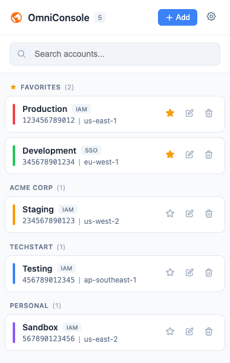
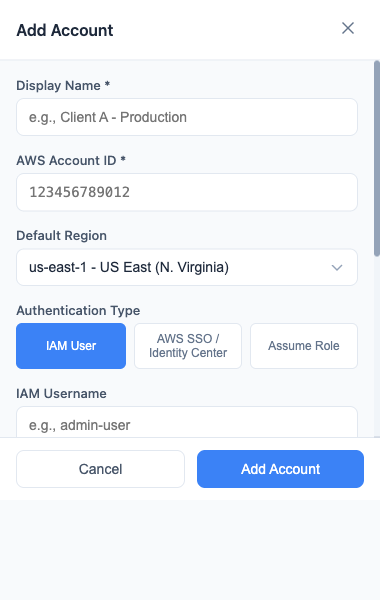
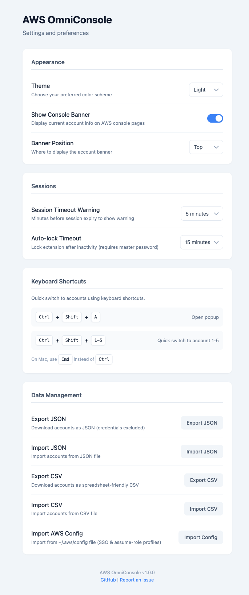

# AWS OmniConsole


[](https://addons.mozilla.org/en-US/firefox/addon/aws-omniconsole/)
[](https://github.com/mraza007/aws-omni/releases)

A browser extension that makes managing multiple AWS accounts less painful. Instead of juggling multiple browsers or digging through password managers, you can simply use this extension to have all your AWS accounts in one place.

I built this to scratch my own itch. I was using different browsers to stay logged into each account, saving credentials in password managers, and constantly losing track of which console was which. This extension fixes that.

## What It Does

- Store all your AWS accounts in one place with nicknames, colors, and notes
- Switch between accounts with a single click
- See which account you're in at a glance (colored banner in the console)
- Use keyboard shortcuts for your most-used accounts
- Group accounts by project, client, or however you organize your life
- Import accounts from CSV or AWS config files
- Works in Chrome and Firefox

## Installation

### Firefox (Recommended)

Install from the official Firefox Add-ons store:

**[Install AWS OmniConsole for Firefox](https://addons.mozilla.org/en-US/firefox/addon/aws-omniconsole/)**

### Chrome / Edge / Brave (Local Install)

Chrome Web Store approval is pending. For now, install manually:

1. Download `aws-omniconsole-chrome.zip` from the [latest release](https://github.com/mraza007/aws-omni/releases/latest)
2. Extract the zip file to a folder
3. Open `chrome://extensions/` in your browser
4. Enable **Developer mode** (toggle in top right corner)
5. Click **Load unpacked**
6. Select the extracted folder
7. The extension icon will appear in your toolbar

### Firefox (Local/Temporary Install)

For development or testing:

1. Download `aws-omniconsole-firefox.zip` from the [latest release](https://github.com/mraza007/aws-omni/releases/latest)
2. Open `about:debugging#/runtime/this-firefox`
3. Click **Load Temporary Add-on**
4. Select the downloaded `.zip` file
5. The extension icon will appear in your toolbar

> **Note**: Temporary add-ons are removed when Firefox closes. Use the Add-ons store for permanent installation.

## Building From Source

You'll need Node.js 18 or later.

```bash
# Install dependencies
npm install

# Build for Chrome
npm run build

# Build for Firefox
npm run build:firefox

# Build both
npm run build:all

# Run tests
npm run test
```

## How to Use

Click the extension icon (or press `Cmd+Shift+A` on Mac, `Ctrl+Shift+A` elsewhere) to open the popup. From there you can:

- Add accounts manually using the "+" button
- Import accounts from a CSV file
- Import from your `~/.aws/config` or `~/.aws/credentials` files
- Search through your accounts
- Click any account to sign in

### Keyboard Shortcuts

The extension supports quick-switch shortcuts for your first five accounts:

- `Cmd/Ctrl + Shift + 1` through `5` to switch to accounts 1-5

You can customize these in your browser's extension keyboard shortcuts settings.

### CSV Import Format

If you're importing from CSV, use this format:

```csv
name,accountId,region,color,group
Production,123456789012,us-east-1,#ef4444,Main
Staging,234567890123,us-west-2,#f59e0b,Main
Development,345678901234,eu-west-1,#22c55e,Dev
```

Only `name` and `accountId` are required. Everything else is optional.

## Data and Privacy

All your account data stays in your browser's local storage. Nothing is sent anywhere. The extension only communicates with AWS domains to perform the actual sign-in.

Credentials, if you choose to store them, are encrypted using AES-GCM with a key derived from a password you set. But honestly, for anything sensitive, you should probably use AWS SSO or IAM Identity Center instead of storing credentials.

## Permissions Explained

The extension asks for a few permissions:

- **storage**: To save your account list
- **tabs**: To open AWS console tabs
- **activeTab**: To inject the colored banner into the current tab
- **notifications**: To show alerts (like session expiring)
- **contextMenus**: For right-click menu options
- **host_permissions for AWS domains**: To interact with AWS sign-in pages

## Known Limitations

- The extension initiates the OAuth sign-in flow but can't automatically complete authentication. You'll still need to enter credentials or use your existing SSO session.
- Session management is basic. AWS sessions have their own timeout logic that the extension can't fully control.

## Screenshots







## Contributing

Found a bug? Have an idea? Open an issue or submit a PR. This is a side project, so response times may vary, but contributions are welcome.

## License

MIT License. See LICENSE file for details.
